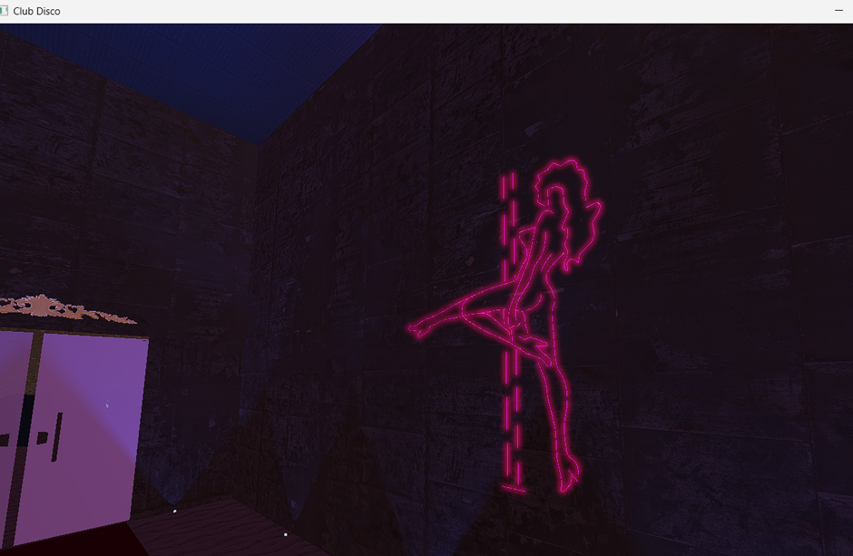
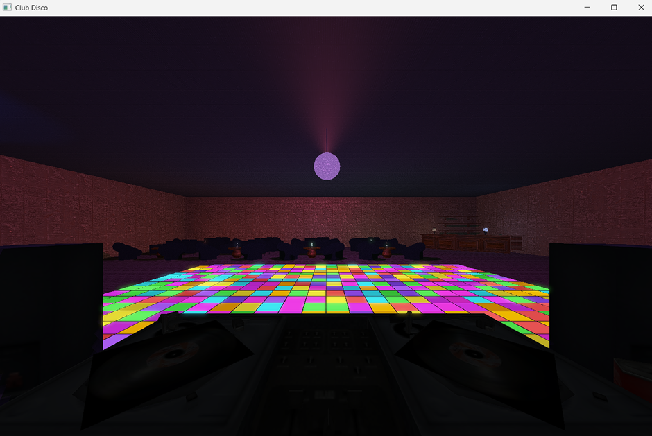

# Disco Club 3D Demo

## Overview

This project is a real-time 3D nightclub demo built in C++ & OpenGL, implementing a complete rendering pipeline with:

- Scene graph hierarchy
- Keyframe-based cinematic camera system
- Phong & Blinn-Phong lighting
- Dynamic shadows via spotlight shadow maps
- HDR rendering with tone mapping
- Bloom effect (bright pass + ping-pong Gaussian blur)
- GPU instanced dance-floor tiles (25x16 grid)
- Particle systems with parabolic movement (confetti cannons)
- Procedural table generation and complex algorithms.
- Kinematics of objects in complex decision-making
- Animated cannon, neon lights, disco ball, and interior props.
- 
The application plays a full cinematic sequence composed of several scenes:
Entrance -> Interior -> Dance Floor -> Ending, lasting almost 3 minutes.

## Controls

### Camera movement

| Key   | Action              |
| ----- | ------------------- |
| **W** | Move forward (Y+)   |
| **S** | Move backward (Y-)  |
| **A** | Strafe left (X-)    |
| **D** | Strafe right (X+)   |
| **Z** | Move up (Z+)        |
| **X** | Move down (Z-)      |
| **Q** | Rotate camera left  |
| **E** | Rotate camera right |

### Mouse Look

Toggle FPS-style mouse movement:
| Key | Action |
| ----- | ------------------------- |
| **M** | Enable/Disable mouse look |

When enabled:

- Cursor hides
- Camera rotates with mouse

### Cinematic Mode

Start/stop cinematic playback:

| Key   | Action                                       |
| ----- | -------------------------------------------- |
| **F** | Toggle cinematic mode (play/pause keyframes) |

Automatically jumps to correct time depending on scene:

| Scene       | Time   |
| ----------- | ------ |
| Entrance    | 0.0s   |
| Interior    | 48.0s  |
| Dance Floor | 120.0s |
| Ending      | 168.0s |

### Music Control

| Key   | Action                            |
| ----- | --------------------------------- |
| **R** | Toggle music playback (play/stop) |

### Confetti Cannons

| Key   | Action                     |
| ----- | -------------------------- |
| **L** | Toggle Left Cannon firing  |
| **K** | Toggle Right Cannon firing |

### Scene Debugging

| Key   | Action                                  |
| ----- | --------------------------------------- |
| **C** | Toggle camera debug mode (prints state) |
| **1** | Reset & load _Entrance Scene_           |
| **2** | Reset & load _Interior Scene_           |
| **3** | Reset & load _Dance Floor Scene_        |

<!-- | 4 | (Disabled due to bug) Load *Ending Scene* | -->

## How to Use the Application

1. Launch the executable.
2. The program begins in the Entrance cinematic.
3. Press F to toggle play/pause of the cinematic camera.
4. Press M to switch to mouse control for manual navigation.
5. Use WASD + ZX + Q/E to move freely in the environment.
6. Press R to toggle the background music.
7. Press L or K to fire the confetti cannons during the DJ scene.
8. Use 1 -> 2 -> 3 to jump between major scenes for testing
9. and MOST IMPORTANT ! Enjoy :)).

## Features Summary

- Full scene graph with hierarchical transformations
- Procedural generation (table sets)
- Forward rendering with multiple lights
- Directional, point and spotlights
- Shadow mapping via spotlight + PCF
- HDR rendering + bloom filter
- Gaussian blur ping-pong implementation
- Instanced rendering of 400 dance-floor tiles and more than 12000 thousand particles (6000 thousand each cannon)
- Particle system with GPU buffers (positions, colors, angles)
- Cinematics driven by an advanced keyframe interpolator curve.
- Automatic timed events (confetti firing, door animations)

## Credits

- C++17
- OpenGL 4.1
- GLFW / GLEW
- GLM
- ppgso framework

## Extras

If you wish, you can review the documents folder; there you will find more detailed information about the most important aspects of the project.

